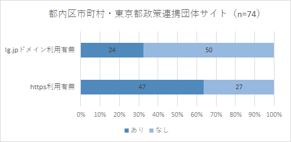

# 都内区市町村・東京都政策連携団体サイトURLのスクレイピング調査

**作業メモ** 
python実行可能環境でweb_scraping.py実行

##  1. Webスクレイピング対象サイト

[都内区市町村・東京都政策連携団体リンク集](https://www.metro.tokyo.lg.jp/link/link04.html)

##  2. スクレイピング結果

[web_scraping_result.csv](./result/web_scraping_result.csv)

##  3. 調査結果

